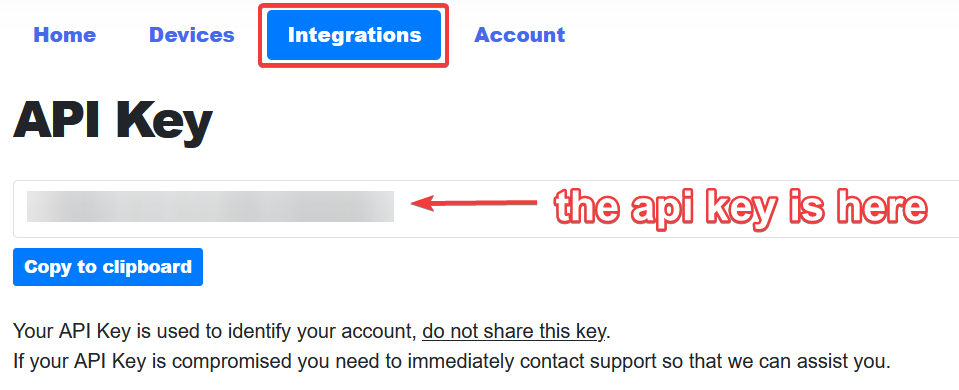

# Face Recogniton IoT

## Motivation
For a long long long time I wanted to work on an IoT project myself. After some discussion at home, I thought it would be cool to build a face recognition device that can be put anywhere in my room. The face recognition device would notify me about anyone in my room. After looking into what it would take to make this project a success, the idea slowly began to grow. I am very happy with what I have achieved although I wanted to build more than was possible. I have enough ideas to grow this project further, and may continue working on it.

I'm proud that I built a working Face Recognition device in limited time. I would have been even more proud if I had managed to not need modules built by others. But I'm still proud with what I achieved.

## Goal
The main goal of the project is to build a face recognition device that I can use to get notified when someone walks into my room. The device should be able to recognize a person in the view of the camera and notify me when someone enters my room. There are various [improvements](#improvements-that-can-be-made) that can be made to the project. The improvements are listed at the bottom of this document.

## IoT Pipeline
When movement is detected on the USB Camera, the IoT Device (Raspberry Pi) analyses the image and sends a request to the IoT Middleware (Push by Techulus). The request includes the name of the person or the word `Unknown` when the person is not recognized. The IoT Middleware sends the request to devices where the Push app has been properly installed and configured. A notification will be shown on these devices.


## Proof
The application sends a notification to a phone via the Push network. The notification contains the name of the person. The image below shows the notification as it was shown on my phone. The notification shows that the camera detected me and that the software was able to identify me.


## Prerequisites
To be able to build this project, you need to have the following things available or installed:
* Raspberry Pi 4, connected to the internet. The instructions assume that the software will be used on a Raspberry Pi 4. The software can run on any device that is connected to the internet, that can install Python and that has a USB port that allows connecting the USB Webcam. Setup instructions will be different when using a different type of device.
* USB Webcam
* [Push account](https://push.techulus.com)
  * You need a Push account to be able to send notifications to your device. You can create an account using this [link](https://push.techulus.com).
  * After signing into the Push account, you will be able to see your api key in the dashboard on the **Integrations**-page. You need to add this key to the `.env` file (which can be copied from the .`env.example` file). Instructions for adding the key can be found in step 6 of the Setup section below.
    

## Setup

1. Install the required Push app on your mobile device.
    * [iOS](https://itunes.apple.com/us/app/push-by-techulus/id1444391917?ls=1&mt=8)
    * [Android](https://play.google.com/store/apps/details?id=com.techulus.push)
2. Login to the Push app with your account.

Now continue with the instructions below.

Setup the Raspberry Pi with the use of their [official guide](https://projects.raspberrypi.org/en/projects/raspberry-pi-setting-up).
After that follow the following steps:
1. Update and restart
    * `sudo apt full-upgrade`
    * `sudo reboot`
2. Install required packages
    * `sudo apt install -y build-essential tk-dev libncurses5-dev libncursesw5-dev libreadline6-dev libdb5.3-dev libgdbm-dev libsqlite3-dev libssl-dev libbz2-dev libexpat1-dev liblzma-dev zlib1g-dev libffi-dev tar wget vim`
3. Install python 3
    * `sudo apt install python3-dev python3-pip`
4. Update pip to the latest version
    * `sudo python3 -m pip install --upgrade pip`
5. Clone this repository
    * `git clone https://github.com/stijnvdkolk/face-recognition-iot.git`
6. Copy the `.env.example` file to `.env` and fill in the `API_KEY` that you obtained from the **Integrations** page on the Push website.
7. Install the required modules
    * `pip install opencv-python face_recognition hiatus requests`
8. Plug in the USB Webcam into the raspberry pi.
9. Start the application
    * `python3 main.py`

## Adding people
> Keep in mind that it will take longer to start the application when more people have been added.

Place an image in the `images/` directory and add the following part to `data.json` between the `[]`.
```json
{
  "name": "NAME_HERE",
  "image": "images/IMAGE_NAME_HERE.IMAGE_EXTENTION_HERE"
}
```
The end result with one item in `data.json` file will look like this.
```json
[
  {
    "name": "Wumpus",
    "image": "images/wumpus.jpg"
  }
]
```
The end result with two items in the `data.json` file will look like this.
```json
[
  {
    "name": "Wumpus",
    "image": "images/wumpus.jpg"
  },
  {
    "name": "Computer Man",
    "image": "images/computer-man.jpg"	
  }
]
```
Information about how to format JSON can be found [here](https://www.json.org).

# Potential improvements
1. Remove the `face_recognition` dependency and write something for it myself. Because of limited time, I used this module. I tried building something myself but it took too much time.
2. Remove the `Push by Techulus` dependency, build something for receiving and sending the notifications myself.
3. Allow more devices to receive notifications.
4. Allow more than one camera to be used.
