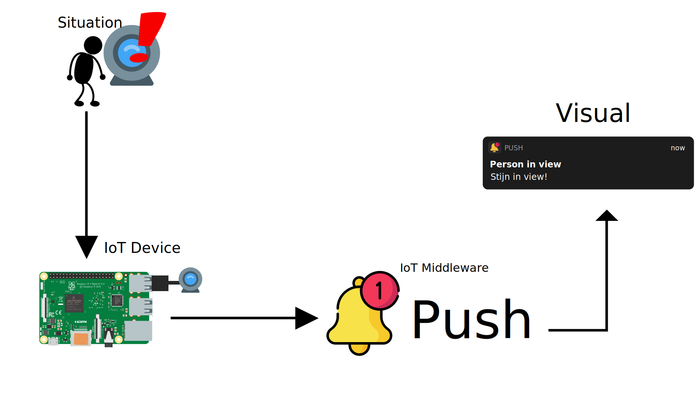

# Face Recogniton IoT

## Motivation
For a long long long time I wanted to built an IoT project myself. After some discussion at home, we came up with the idea to build an face recognition device which can be put anywhere in the house and notify people about someone in their home. After looking into the project, the idea slowly began to grow. Sadly it became too big to build all of it. 

## IoT Pipeline

## Prerequisites
* Raspberry Pi 4 connected to the internet (you can run this program with each device that can be connected to the internet, run Python and have a USB port)
* Python 3 with the following modules installed:
  * opencv-python
  * face_recognition
  * hiatus
  * requests
* USB Webcam
* Push account (https://push.techulus.com)

## Setup
Setup the Raspberry Pi with the use of their [official guide](https://projects.raspberrypi.org/en/projects/raspberry-pi-setting-up).
After that follow the following steps:
1. Update and restart
    * `sudo apt full-upgrade`
    * `sudo reboot`
2. Install prerequisites
    * `sudo apt install -y build-essential tk-dev libncurses5-dev libncursesw5-dev libreadline6-dev libdb5.3-dev libgdbm-dev libsqlite3-dev libssl-dev libbz2-dev libexpat1-dev liblzma-dev zlib1g-dev libffi-dev tar wget vim`
3. Install python 3
    * `sudo apt install python3-dev python3-pip`
4. Update pip to the latest version
    * `sudo python3 -m pip install --upgrade pip`
5. Clone this repository
    * `git clone https://github.com/stijnvdkolk/face-recognition-iot.git`
6. Copy the `.env.example` file to `.env` and fill in the required environment variables
7. Install the required modules
    * `pip install opencv-python face_recognition hiatus requests`
8. Plug in the USB Webcam into the raspberry pi.
9. Start the application
    * `python3 main.py`

# Improvements that can be made
1. Remove the `face_recognition` dependency and write something for it myself. Because of limited time, I used this module. I tried building something myself but it took too much time.
2. Remove the `Push by Techulus` dependency, build something for receiving and sending the notifications myself.
3. Allow more devices to receive notifications.
4. Allow more than one camera.
